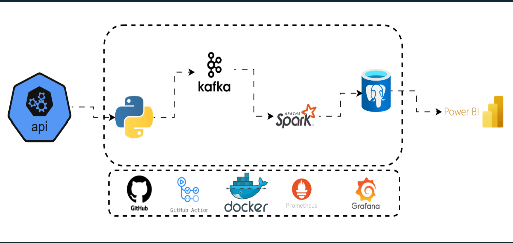
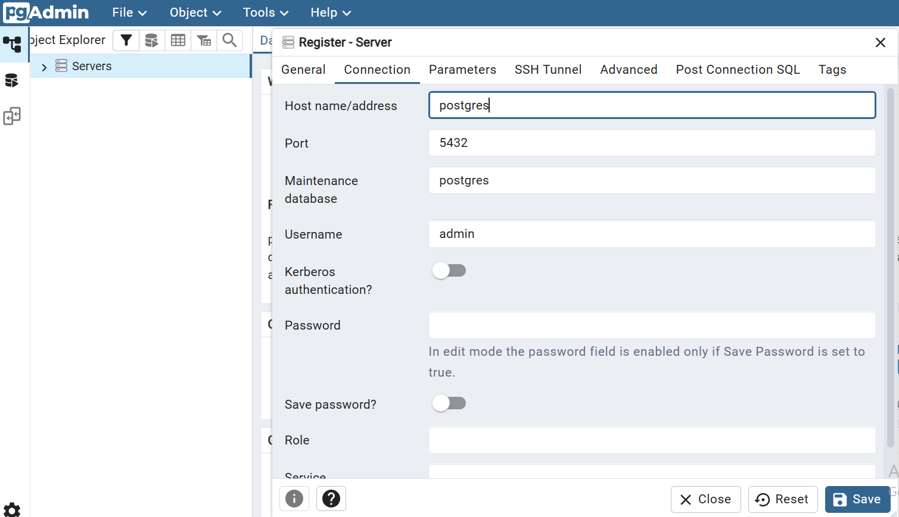
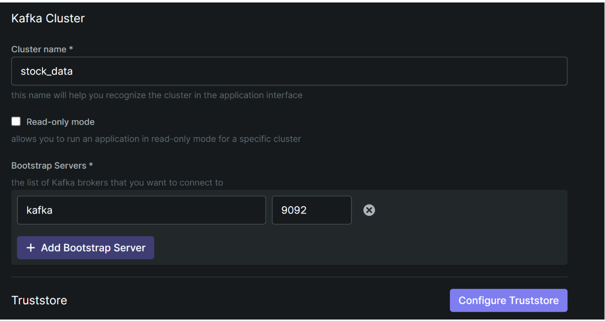
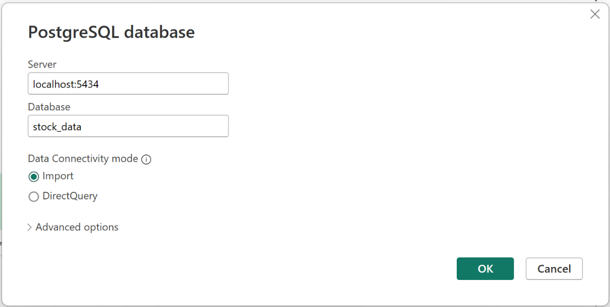
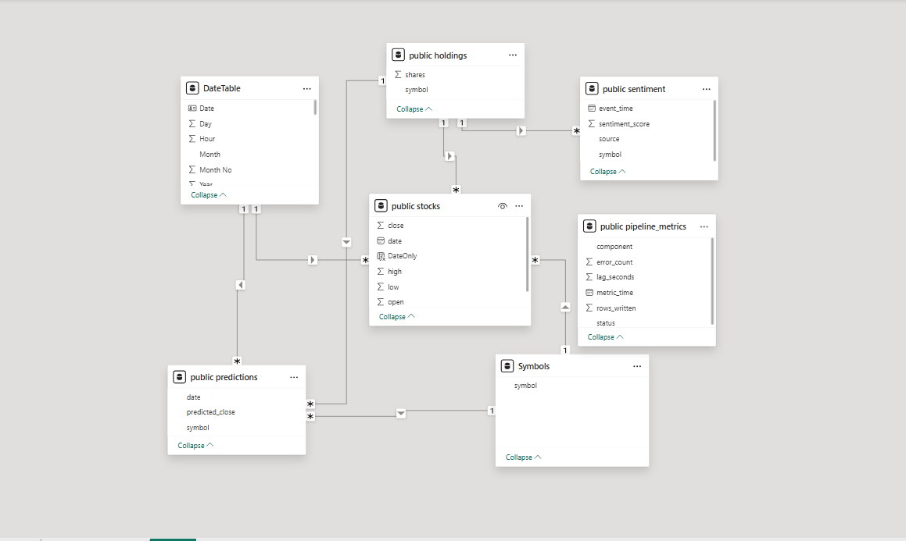

# MarketpulseAnalytics
A Real-Time Stock Market Data Engineering and Analytics for Stock, market insights and Reporting.

## Project Overview

This project is an end-to-end, containerized data engineering framework, built to deliver scalable, real-time financial intelligence.
The system extracts live stock market data from external APIs, streams data through Apache Kafka for real-time ingestion,
processes and transforms data using Apache Spark and loads curated datasets into PostgreSQL.It Visualizes insights through Power BI executive dashboards

The plateform was designed to provide:
- Real-time stock market monitoring
- Predictive price analytics
- Portfolio performance optimization
- Sentiment-driven trading signals
-System reliability and monitoring analytics

It directly addresses the organization's key challenges, including:

- Growing demand for advanced analytics
 
- Data latency in multi-source ingestion

- Pipeline reliability and anomaly detection

- Infrastructure scalability during high market activity

All components are fully containerized using Docker, ensuring portability, scalability, and simplified deployment across environments.

[Data Source](https://rapidapi.com/alphavantage/api/alpha-vantage/playground/apiendpoint_55220bb2-8a64-4cde-89e1-87ec00947f57)

Data Pipeline Architecture


### Business Context
Marketpulse is a financial organisation that specialises in real-time stock market analysis, financial forecasting, and trading strategy optimization in Nerw york.
## Business Challenges
### Advanced Analytics Demand
Clients require more insights including,

- Predictive price modeling

- Sentiment-based insights

- Risk-return optimization

- Signals (Buy/Hold/Sell) 
### Data Latency
The current infrastructure has occasional latency issues, which includes multi-source ingestion delays and real-time accuracy degradation.This inturn affect the accuracy of the report and customer decision-making.
### Scalability: 
As data volumes continue to increase, the current infrastructure faces limitations in scaling efficiently. This leads to performance bottlenecks and delays in delivering real-time insights to clients, particularly during periods of peak market activity such as market openings, closings, and earnings announcements.

### System Reliability:

The increasing complexity of the data pipeline introduces higher operational risk and potential points of failure. The absence of comprehensive monitoring metrics limits visibility into system performance, while delayed anomaly detection hinders timely issue resolution and impacts overall reliability
## Project Objectives

- Design and Implement a Scalable Real-Time Data Pipeline:
Architect and deploy a fault-tolerant, highly scalable streaming pipeline using Apache Kafka to ingest and process stock market data from multiple exchanges, ensuring low latency, high availability, and resilience under peak market conditions.

- Improve Data Accuracy and Real-Time Performance:
Optimize data ingestion and processing workflows to minimize latency, enhance data integrity, and deliver accurate, near real-time financial insights to support high-frequency trading and risk management decisions.

- Develop Executive-Level Analytics and Visualization:
Build interactive, real-time Power BI dashboards to visualize market trends, stock performance, predictive signals, and portfolio metrics—enabling data-driven decision-making for investment managers and financial stakeholders.
### Project Deliverable
Deliver a production-ready, scalable real-time data engineering and analytics platform that enables MarketPulse Analytics to meet growing client demand for timely, accurate stock market intelligence. The solution positions the organization competitively by providing low-latency insights, advanced analytics capabilities, and a robust infrastructure designed to support high-volume market activity and evolving industry requirements.
### Project Stack
- API → Produces JSON events into Kafka.
- Kafka / Kafka UI → Inspect topics/messages.
- Spark → Consumes and process data from Kafka, writes to Postgres.
- Postgres → Stores results for analytics.
- pgAdmin → Manage Postgres visually.
- Power BI → External (connects to Postgres database).
## Project Setup
  ### Clone the repository
  ```cmd
  git clone https://github.com/Chuks3774/MarketpulseAnalytics.git

  ### Navigate to project directory
  cd MarketpulseAnalytics
  ```
  ## Setup Environment Variables
  ```python
    # Create a .env file in project root directory

  ## get your API key from the api data source mentioned above
  API_KEY=ADD API KEY
  POSTGRES_USER=admin
  POSTGRES_PASSWORD=admin
  PGADMIN_DEFAULT_EMAIL=sample@admin.com
  PGADMIN_DEFAULT_PASSWORD=admin
  ```
  ### Create And Activate The Virtual Environment
  ```python
    python -m venv venv
  source venv/Scripts/activate
  ```
  ### Install Project Dependencies
  ```python
    pip install -r requirements.txt
```
### Run The Docker Service
```
  docker compose up -d
  ```
## Database Schema (PostgreSQL)
### Stock
```sql
stocks(
    symbol VARCHAR,
    date TIMESTAMP,
    open DOUBLE PRECISION,
    high DOUBLE PRECISION,
    low DOUBLE PRECISION,
    close DOUBLE PRECISION
)
```
### holdings
- Used for portfolio valuation and weight calculation
```sql
holdings(
    symbol VARCHAR,
    shares INTEGER
)
```
### Predictions
- for Predictive price comparison and Signal generation
```sql
predictions(
    symbol VARCHAR,
    date TIMESTAMP,
    predicted_close DOUBLE PRECISION
)
```
### Sentiment
- for Market mood analysis ,Sentiment overlays and Signal confirmation.
```sql
sentiment(
    symbol VARCHAR,
    event_time TIMESTAMP,
    sentiment_score DOUBLE PRECISION,
    source VARCHAR(50)
)
```
### Pipeline_metrics
for reliability dashboard,latency monitoring and throughput tracking
```sql
pipeline_metrics(
    component VARCHAR,
    metric_time TIMESTAMP,
    status VARCHAR,
    error_count INTEGER,
    lag_seconds INTEGER,
    rows_written INTEGER
)
```
## Connect To The Postgresql Database Server From Pgadmin
## Connect To Kafka Server From The Kafka Client
```sql
  ## pgadmin: Create your database and tables with the client: (dbname: stock_data, db_table:stocks)
  localhost:5050

  ## kafka-ui 
  localhost:8085
  ```
### Postgres Login From Pgadmin

### Kafka Login From Kafka UI

### Run The Python Producer Script To Send Data To Kafka
```python
  python producer/main.py

  ## Login to the kafka ui client to see the messages pushed to kafka: ( topic name - stock_analysis )
```
### Inspect The Consumer Script: Read Data From Kafka And Load To Postgres
```python
  ## Login to Docker Desktop, locate the name of the project container, expand it and click on the consumer service  (Inspect the logs). This is now sending data to your postgres database

  ## Login to the pgadmin client and check the messages now streamed into the (stock_data:stocks) database table. 
  ## You need to run the `SELECT * FROM Table` query
  ```
  ### Connect Power BI To Postgres
  
### Shut Down Server
```cmd
  docker compose down -v
```
### PostgreSQL (Serving Layer)
Schemas

### ANALYTICS LAYER
Power BI Dashboard Structures
Pages:
1. Market Overview
2. Predictive Analytics
3. Portfolio Optimization
4. Sentiment Intelligence
5. Reliability Monitoring

https://app.powerbi.com/view?r=eyJrIjoiMzkxNTQ1OTAtYTJiYS00OTNlLWE2MTYtNTRlNzA1OGUzYjBkIiwidCI6IjUxYTBhNjljLTBlNGYtNGIzZC1iNjQyLTEyZTAxMzE5ODYzNSIsImMiOjh9


